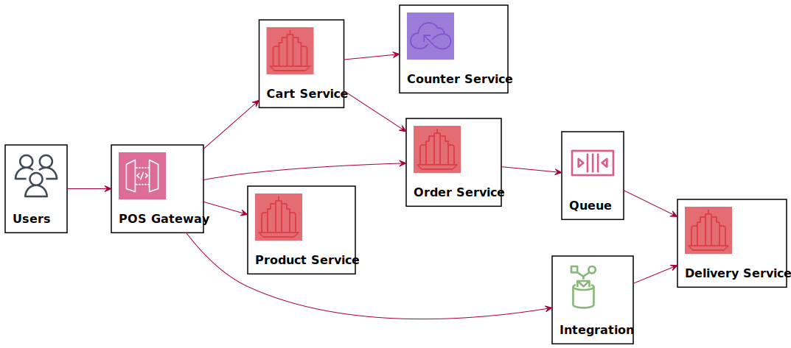
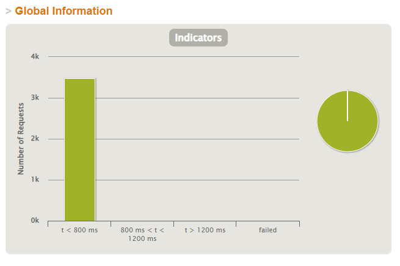
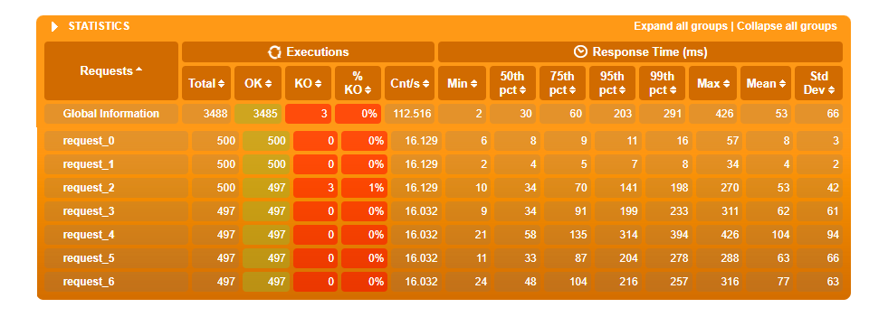

# aw10-final

Please develop a **fully functional** online purchase order system.

- It should have a superb collection of goods merchandises
- Customer can browse/search for merchandises, add selected one into his shopping cart and checkout to complete a transaction.
- User can get delivery status updates continuously.

The system should be of a **reactive architecture**, which means it should be 

-  Responsive: it should response to the user request timely.
-  Resilient: it should not be easily broken down.
-  Elastic: it should be flexible to scale out.
-  Message Driven: it should has loosely coupled components that communicates with each other asynchronously.

Please design tests/experiements to demostrate that your system fulfills such requirements as stated in [The Reactive Manifesto](https://www.reactivemanifesto.org)

**Submit your codes/documents/tests/experiements of your system.**

# 系统说明

## 系统结构

## 模块功能

1. pos-discovery：注册中心，使用Eureka

2. pos-gateway：网关，将发送至网关的请求转发至每个微服务节点

3. pos-api：使用openapi生成接口规范DTO传输对象

4. pos-products：商品模块，为系统提供商品相关的api接口，使用响应式的接口形式与响应式非阻塞的数据库驱动（r2dbc），达到响应式的微服务

   > Info for a specific product GET /products/{productId} 
   >
   > List all products GET /products 

5. pos-carts：购物车模块，为系统提供购物车相关的api接口，使用响应式的接口形式与响应式非阻塞的数据库驱动（r2dbc），达到响应式的微服务

   > Create a new cart POST /carts 
   >
   > List all carts GET /carts 
   >
   > Info for a specific cart GET /carts/{cartId} 
   >
   > Add an item to cart POST /carts/{cartId} 
   >
   > Total for a specific cart GET /carts/{cartId}/total 
   >
   > Checkout a cart POST /carts/{cartId}/total 

6. pos-counter：计算模块，为购物车提供计算总价值的服务

   > checkout a cart POST /counter/checkout 

7. pos-order：订单模块，为系统提供订单相关的api接口，使用响应式的接口形式与响应式非阻塞的数据库驱动（r2dbc），达到响应式的微服务。

   > List all orders GET /orders 
   >
   > Create a new order POST /orders 
   >
   > Info for a specific order GET /orders/{orderId}

8. pos-delivery：运单模块，为系统提供运单相关的api接口，使用响应式的接口形式与响应式非阻塞的数据库驱动（r2dbc），达到响应式的微服务。

   > List all deliveries GET /deliveries 
   >
   > Info for a specific delivery GET /deliveries/{deliveryId} 
   >
   > Create a new delivery POST /deliveries 

9. pos-gatling：测试模块，使用gatling进行性能测试

# 性能测试

使用gatling进行性能测试，模拟500个用户的并发度，每个用户供执行7个请求，在30s内逐渐提升至500个并发用户数

> 1. 查询商品列表
> 2. 查询某个商品的具体信息
> 3. 新建购物车
> 4. 查看购物车
> 5. 将商品加入购物车
> 6. 查看购物车内商品总价值
> 7. 提交购物车生成订单与运单

测试结果如下：

可以看到，所有响应的延迟均在800ms内

# 响应式系统特点

## Responsive

响应式系统采用的是一种面向数据流的声明式关系范式，会对发生的变化做出及时响应。在本系统中，系统会对接受的请求做出响应，且当访问并发量较大时，仍可以很好的满足响应要求。

## Resilient

系统的采用的是微服务的架构模式，单一节点发生问题并不会导致整个系统的崩溃。由于每一个微服务都是独立运行的，在微服务架构中可以实现更好的故障隔离，当一个微服务发生问题时，不会影响到其他的微服务。同时，在微服务模块进行通讯时，配置有熔断机制，不会因为调用过程中某一个环节出现问题而影响其他服务。

## Elastic

由于微服务系统本身的特性，每个微服务节点都具有一定的弹性，可以自由进行拓展。例如可以为单一节点改变硬件条件实现垂直拓展，或者为某个微服务配置集群来达到水平拓展。

## Message Driven

响应式编程通常是采用异步回调的方式，故在处理事件时，框架会将持续不断的事件放入消息队列，形成消息流。同时框架会不断的取出消息，调用相应的消息处理函数来完成回调，达到消息驱动的特性。不同组件之间使用异步消息传递来进行交互，并确保松耦合及相互隔离。

